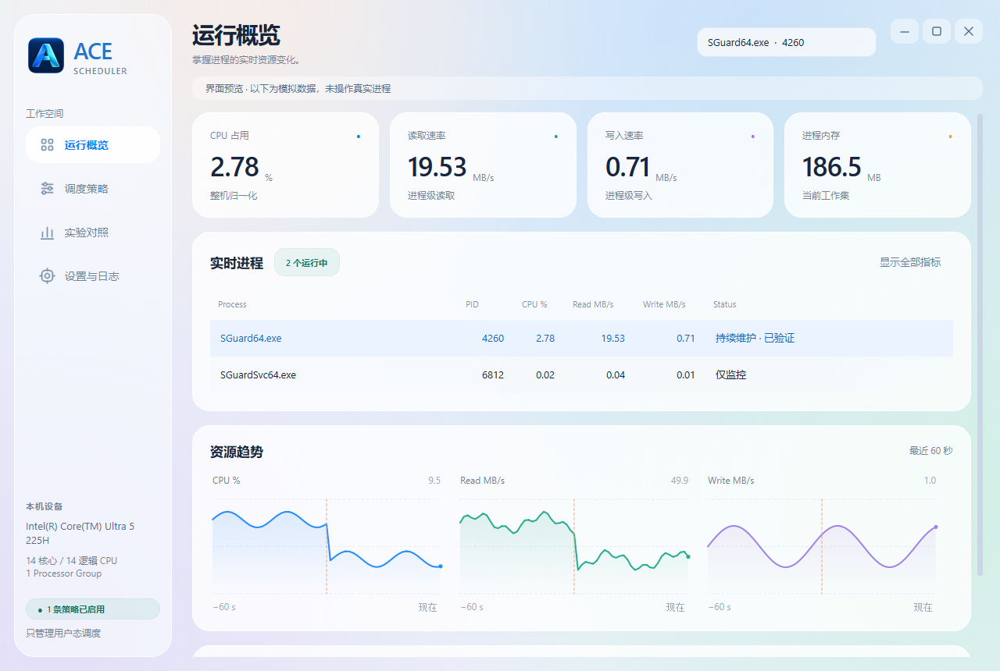
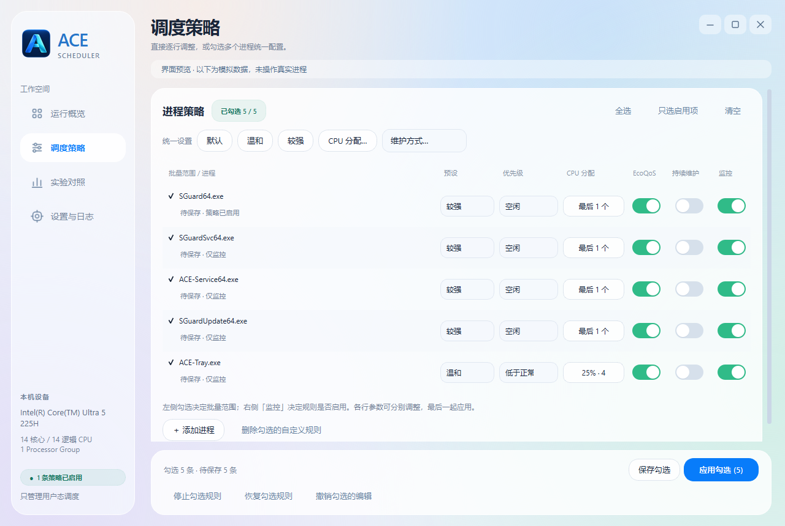
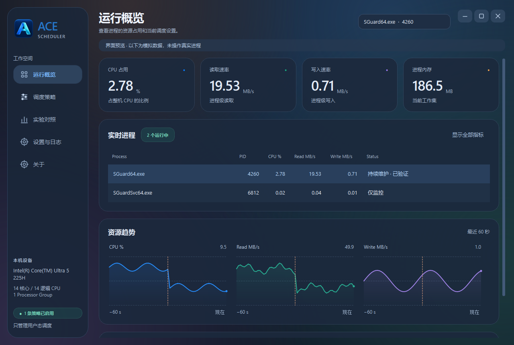

<p align="center">
  
</p>

<h1 align="center">ACE Scheduler</h1>

<p align="center">查看进程资源占用，按需调整 CPU 调度。</p>
<p align="center">Monitor Windows processes, adjust CPU scheduling, and restore previous settings.</p>

<p align="center">
  <a href="https://github.com/chenlaoc/ace-scheduler/actions/workflows/ci.yml"></a>
  <br>Windows x64 · Python 3.11+ · PySide6 · v1.5.0
</p>

<p align="center">
  <a href="https://github.com/chenlaoc/ace-scheduler/releases">下载版本</a> ·
  <a href="docs/USER_GUIDE.md">使用指南</a> ·
  <a href="docs/DEVELOPMENT.md">开发指南</a> ·
  <a href="docs/TESTING.md">测试与验证</a> ·
  <a href="CHANGELOG.md">更新记录</a>
</p>

ACE Scheduler 可以查看 Windows **用户态进程**的资源占用，调整 CPU 调度，并比较调整前后的变化。程序内置 ACE 相关进程名称，也支持添加完整的 `.exe` 文件名。结束实验时，可以恢复修改前的设置。

每次启动都先观察，点击应用后才会调整进程。保存规则、选择预设或切换页面都不会改变调度设置。修改后，程序会通过 Windows API 读取实际值，确认操作结果。



> 截图中的数据为模拟数据，只用于展示界面，不能用来判断游戏性能或 I/O 是否改善。

## 界面与功能

| 模块 | 可以做什么 |
| --- | --- |
| **运行概览** | 选择进程，查看它占整机的 CPU 比例、内存、进程 I/O 和当前调度设置 |
| **调度策略** | 直接逐行修改，或勾选多行统一设置 Priority、CPU Affinity、EcoQoS 与维护方式 |
| **实验对照** | 保留应用前的数据，与应用后最近 60 秒比较，导出 CSV |
| **设置与日志** | 设置采样间隔和关闭方式，恢复异常退出前的设置，重启后台或导出脱敏诊断 |
| **关于** | 查看版本、构建信息和许可，打开配置目录，前往私有仓库查看更新或反馈问题 |



可以拖动标题栏移动窗口、双击最大化，或拖动边缘调整大小，也可以使用标题栏上的窗口按钮。切换页面和后台刷新不会清掉尚未保存的编辑，批量操作按钮始终留在页面底部。

## 快速开始

### 使用桌面程序

1. 从 [Releases](https://github.com/chenlaoc/ace-scheduler/releases) 下载 `ACE-Scheduler-vX.Y.Z-x64.zip`，解压整个目录。
2. 运行 `ACE-Scheduler.exe`；保留旁边的 `_internal` 文件夹。
3. 先在“运行概览”观察一段时间，再到“调度策略”设置参数，点击“应用勾选”。结束实验时选择恢复原设置。

普通启动会先申请管理员权限，授权后直接打开主窗口，之后点击应用或恢复即可执行。取消 UAC 会结束本次启动，不再打开普通权限窗口。程序启动后仍先观察，不会自动应用保存的策略。已有窗口时优先唤醒它。只需查看数据时，可以用不请求管理员权限的只读模式启动：

```powershell
.\ACE-Scheduler.exe --monitor-only
```

当前发行包在 Windows 11 x64 上验证。Windows 10、Windows ARM64，以及跨 Processor Group 的 Affinity 尚未完成发行验证。从源码运行需要 Windows 和 64 位 Python 3.11+。受保护的进程可能拒绝修改，程序会显示实际结果。

### 从源码启动

```powershell
git clone https://github.com/chenlaoc/ace-scheduler.git
cd ace-scheduler
py -3.13 -m venv .venv
.\.venv\Scripts\python.exe -m pip install -r requirements-lock.txt
.\.venv\Scripts\python.exe -m ace_scheduler --monitor-only
```

仓库是私有的，克隆与下载需要仓库访问权限。开发环境、构建命令和模块说明见 [开发指南](docs/DEVELOPMENT.md)。

## 调度方式

| 预设 | Priority | CPU Affinity | EcoQoS |
| --- | --- | --- | --- |
| 默认 | Normal | 全部可用逻辑 CPU | OFF |
| 温和 | Below Normal | 最后 25%，至少 2 个，不超过可用总数 | ON |
| 较强 | Idle | 最后 1 个可用逻辑 CPU | ON |
| 自定义 | 按行选择 | 自选或动态集合 | 按行选择 |

- **仅应用一次**：本会话中每个进程实例应用一次，进程重启后识别新实例。
- **持续维护**：按维护间隔检查进程的实际设置，有变化时重新应用策略，检查节奏独立于数据采样。
- **停止规则**：停止后续自动应用，保留当前值。
- **恢复原设置**：恢复这个进程首次修改前记录的值，也支持上次异常退出后留下的记录。如果其他程序改过同一项设置，会先保留当前值并提示冲突。“默认”预设是一组固定参数，不能代替恢复原设置。

“最后一个 CPU”指逻辑编号，不代表效率核。25% 是选取的逻辑 CPU 数量比例，不是 CPU 使用率硬上限。多组或超过 64 个逻辑 CPU 时禁用 Affinity，保留监控、Priority 与 EcoQoS。

## 项目边界

程序通过 Windows 正常接口调整调度，不提供终止或挂起进程、管理服务、修改驱动、代码注入或绕过反作弊的功能，也不修改 I/O Priority。仓库不包含第三方参考程序的二进制或源码。

进程 I/O 不能作为 SSD 的实际读取量，调整 CPU 调度也不会直接限制磁盘速度。使用本工具不保证提升帧率、延长磁盘寿命或兼容所有游戏。各项指标的含义、进程匹配方式和恢复规则见 [使用指南](docs/USER_GUIDE.md)，实现依据见 [架构文档](docs/ARCHITECTURE.md)。

## 外观

在“设置与日志 → 外观”中选择亮色、暗色或自适应（跟随系统）。选择会自动保存并立即生效，无需重启；自适应是默认选项，系统切换亮暗色时会同步更新。切换主题不会改变策略或清掉尚未保存的编辑。



## 配置与升级

配置和日志保存在 `%APPDATA%\ACE-CPU-Scheduler`。v1.4.0 更名为 **ACE Scheduler** 后，仍使用旧目录和实例锁，升级无需迁移规则。

v1.5.0 会在每次修改前保存恢复记录。如果程序异常退出，下次打开时可选择恢复。恢复前会核对是否仍是原来的进程，并检查当前设置。系统重启后或超过 30 天的记录会归档，不再用它们恢复其他进程。

关闭窗口默认会退出应用，也可以在设置中改为隐藏到托盘。托盘菜单里的“停止全部规则”会保留当前调度值；选择“真正退出”时，如有需要处理的修改，仍会询问是否恢复。诊断 ZIP 只保存脱敏后的摘要，不会上传。实现细节和验证范围见 [本阶段实现记录](docs/DAILY_USABILITY.md)。

## 质量与协作

Windows CI 在 Python 3.11 / 3.13 上运行测试，并单独构建 EXE、验证只读启动、产出 ZIP 与 SHA-256。Windows 写入测试仅操作测试自行创建的子进程。

- [测试策略与复现方法](docs/TESTING.md) · [31 组交互测试记录](docs/INTERACTIVE_TEST_PLAN.md)
- [贡献规范](CONTRIBUTING.md) · [问题反馈](https://github.com/chenlaoc/ace-scheduler/issues/new/choose)
- [安全问题报告](SECURITY.md) · [维护与发布](docs/RELEASING.md) · [路线图](docs/ROADMAP.md)
- [品牌资产与生成记录](docs/BRANDING.md) · [第三方声明](THIRD_PARTY_NOTICES.md)

项目由 [@chenlaoc](https://github.com/chenlaoc) 维护，当前为私有项目，原始项目代码与品牌保留全部权利；访问仓库不等同于获得再分发许可。第三方组件按各自许可使用，详见 [LICENSE](LICENSE)。
